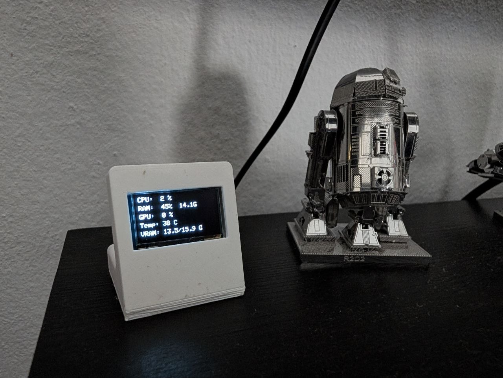
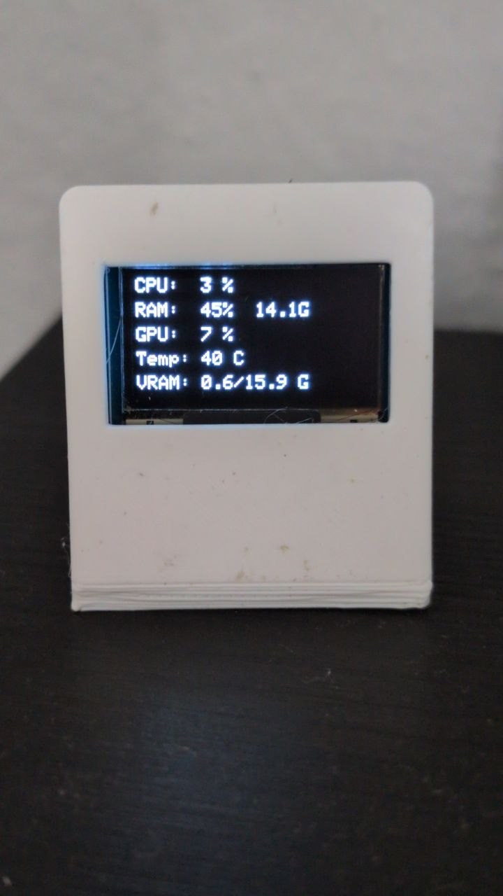

# ESP32 OLED PC Monitor 🖥️🔋




This project displays real-time statistics of your Windows PC's **CPU, RAM, GPU (NVIDIA), and VRAM** on an SSD1306 OLED screen (128x64, I2C) connected to an **ESP32-C3** microcontroller via USB (no WiFi required).

For the Spanish version of this guide, please check [README_ES.md](README_ES.md).

## 🚀 Features
- **Displayed Metrics**:
  - CPU usage (%)
  - RAM usage (% and GBs used)
  - GPU usage (%)
  - GPU Temperature (°C)
  - VRAM usage (GB used / GB total)
- **Robustness**:
  - Automatic reconnection logic in Python if the USB cable is disconnected.
  - Enhanced USB CDC boot timing handling for ESP32-C3 boards.
  - Continuous retry loop with serial debugging output in case of OLED initialization failures.

---

## 🛠️ Hardware Requirements
1. **ESP32-C3** development board (e.g., ESP32-C3 Super Mini or similar).
2. **SSD1306 OLED** 128x64 display (I2C interface, default address `0x3C`).
3. USB data cable (Micro-USB or USB-C depending on your board).
4. Wiring (verified and stable at 50 kHz):
   - **SDA** -> **GPIO 8** (ESP32-C3)
   - **SCL** -> **GPIO 9** (ESP32-C3)
   - **VCC** -> **3.3V**
   - **GND** -> **GND**

---

## 💻 Installation & Configuration

### 1. Flash the ESP32-C3 (Arduino IDE)
Make sure you install the following libraries using the Arduino Library Manager:
- **Adafruit SSD1306**
- **Adafruit GFX Library**
- **ArduinoJson** (version 6 or 7)

#### Recommended upload settings in Arduino IDE:
- **Board**: *ESP32C3 Dev Module* (or your specific ESP32-C3 variant).
- **USB CDC On Boot**: *Enabled* (critical on ESP32-C3 boards to allow native serial-over-USB communication).
- Open the main sketch `esp32_oled_pc_monitor.ino` and upload it to the board.

> 💡 **Tip**: If you are unsure about the wiring connection, flash the diagnostic tool `tools/i2c_scanner/i2c_scanner.ino` first. Open the Serial Monitor at `115200` baud to confirm the chip successfully detects the display address at `0x3C`.

---

### 2. PC Setup (Python)
Ensure you have Python installed on your Windows PC.

1. Install the required dependencies:
   ```bash
   pip install -r requirements.txt
   ```
   *(This will install `psutil`, `pyserial`, and `nvidia-ml-py`)*.

2. Open `pc_monitor_serial.py` and modify the `SERIAL_PORT` variable to match the COM port assigned to your ESP32-C3 (you can verify this in the Windows *Device Manager* under "Ports (COM & LPT)"):
   ```python
   SERIAL_PORT = "COM6"  # <-- Change this to your actual COM port
   ```

3. Run the script:
   ```bash
   python pc_monitor_serial.py
   ```

The script will automatically detect your NVIDIA GPU and start pushing metrics every 2 seconds. The OLED screen will immediately update with the real-time PC data.

---

### 3. Autostart on Boot (Windows)
If you want the PC Monitor script to run automatically in the background every time Windows starts:

1. Double-click the file `register_startup.bat` (if it fails, right-click and choose **Run as administrator**).
2. This creates a task in the **Windows Task Scheduler** that runs `pc_monitor_serial.py` silently in the background using `pythonw.exe` (no black terminal window will pop up).
3. If you ever want to stop it from running on boot, double-click `unregister_startup.bat`.

---

## 📐 3D Printed Case Attribution
The 3D printable case used in this project is a remix of the model:
- **ZMK Nice Nano 128x64 OLED Dongle** by James
- Source Link: [Printables Model 1443110](https://www.printables.com/model/1443110-zmk-nice-nano-128x64-oled-dongle-xiao-ble-remix)
- License: [Creative Commons Attribution (CC BY 4.0)](https://creativecommons.org/licenses/by/4.0/)


